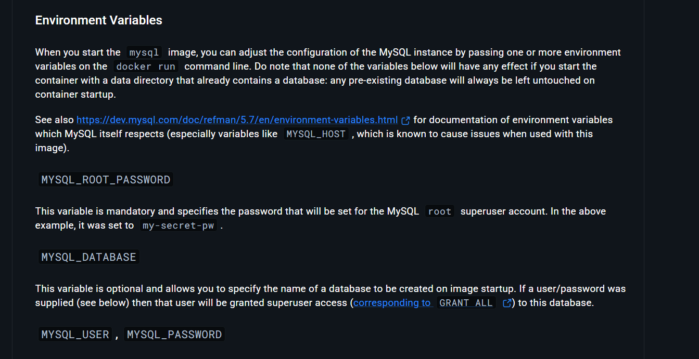

# Containerizing WordPress Application.
This mini project is about deploying Wordpress application using Docker container. 
By separating the web frontend (WordPress) and the database backend (Mysql) into distinct containers, we achieve a modular and scalable architecture.
***
## Architecture.
This consist of two main components:

1. Mysql Container 
2. Wordpress Container


***
# prerequisites:
Launch a ec2 instance get ssh and install docker. Login to docker hub for env. reference.
***
# Deployment Steps.
## 1. Step:
Launch Mysql container with necessary environment variables.
[you can check mandatory env. variables on docker hub.]


**Command to run Mysql Container:**

```docker run -d --name mydb -e MYSQL_ROOT_PASSWORD=root -e MYSQL_DATABASE=wordpressdb mysql```

## 2. Step:
Launch Wordpress container with necessary environment variables:

1. Hostname: Database container name.
2. Username: Username to log into database.
3. Password: For the username.This must match the MYSQL_ROOT_PASSWORD you set when you launched your Mysql container.
4. Database name: This tells Wordpress to use specific database you created while launching Mysql container.

**Command to run Wordpress Container:** 

```docker run -d -P --name mywordpress -e WORDPRESS_DB_HOST=mydb -e WORDPRESS_DB_USER=root -e WORDPRESS_DB_PASSWORD=root -e WORDPRESS_DB_NAME=wordpressdb --link mydb:mysql wordpress``` 

**Now hit the IP with Wordpress container port &rarr; Select language &rarr; Enter your site title and other information needed and install Wordpress &rarr; Enter login details &rarr; And it is done.**

# Key Troubleshooting:
1. Database Connection Errors: I learned the importance of exact matching for Environment Variables. A simple typo (like using a hyphen instead of an equals sign) can break the link between application and database.
2. Match the MYSQL_ROOT_PASSWORD=root to WORDPRESS_DB_USER=root. If these don't match exactly, you can get error like "Error establishing a database connection."
3.  Always run Mysql container first because you need env. variables related to Mysql container in Wordpress container like Database name.
4. Do not forgot to add port range from 32000 to 65535 in security group. It is the port range used for port mapping when used -P flag.[you can also map ports manually]
5. Latest versions of Wordpress and Mysql are recommended it has better features.
***
*Last updated: May 2026*